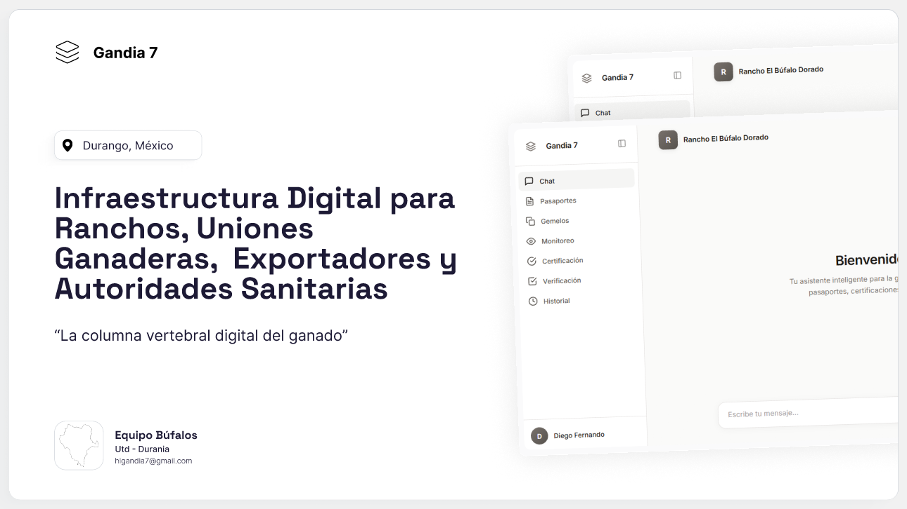

# GANDIA 7

**Sistema Integral de Trazabilidad Ganadera**



> Infraestructura Digital Institucional para la Trazabilidad Ganadera Binacional México-USA

---

    ## Descripción
    
    GANDIA 7 representa la vanguardia tecnológica en la gestión pecuaria. Es un sistema institucional diseñado para garantizar la integridad de la cadena de suministro mediante la convergencia de Biometría de Precisión, IA Determinística y Libros Mayores Distribuidos (Blockchain).
    
    **Contexto Institucional:**
    - Universidad Tecnológica de Durango (UTD)
    - Equipo Búfalos – Iniciativa GALARDÓN DuranIA
    - Enero 2026 | Durango, México
    
    ## Diagnóstico y Problemática
    
    ### Impacto Financiero y Operativo
    La industria ganadera enfrenta ineficiencias críticas que comprometen la rentabilidad y la competitividad internacional:
    Pérdidas Económicas Globales: El sector lechero registra un impacto anual de USD $65,000M derivado de patologías no controladas.
    Vulnerabilidad Comercial: México ha experimentado una contracción del 41% en sus exportaciones debido a suspensiones por incumplimiento de protocolos sanitarios.
    Inercia Burocrática: Los procesos de certificación para exportación promedian entre 2 y 4 semanas, ralentizando el flujo de caja y la logística.
    Fragilidad de Activos de Información: El 42% de los productores sufre la pérdida de registros históricos y documentación crítica en un horizonte de 5 años, eliminando la          trazabilidad necesaria para auditorías.

    ### Brechas Tecnológicas y de Infraestructura
    Los sistemas actuales no están alineados con la realidad del entorno rural, lo que genera las siguientes limitantes:
    Fricción en la Adopción Digital: Interfaces complejas que no consideran la brecha de habilidades digitales de los productores.
    Inseguridad en la Identificación Física: El uso de dispositivos externos (aretes) presenta una tasa de extravío del 10-20%, invalidando la identidad del semoviente.
    Aislamiento Conectivo: El 60% de las Unidades de Producción Pecuaria (UPP) carece de cobertura de red, inhabilitando las soluciones basadas exclusivamente en la nube.
    Fragmentación Sistémica: Una desconexión estructural entre los requerimientos legales de cumplimiento y los flujos operativos diarios en el campo.
    
    ## Arquitectura del Ecosistema
    Nuestra infraestructura tecnológica ha sido diseñada bajo principios de resiliencia, descentralización y alta disponibilidad, garantizando la integridad de los datos desde el campo hasta la cadena de bloques.

    Stack Tecnológico de Alto Rendimiento

    Interfaz de Usuario y Movilidad (Frontend)
    *    React Native & Expo SDK: Framework de desarrollo híbrido que permite una experiencia nativa fluida, optimizando el despliegue tanto en iOS como en Android con una única base de código.
    *    TypeScript: Implementación de tipado estático para garantizar un código robusto, predecible y libre de errores en tiempo de ejecución.
    *    Tailwind CSS: Metodología utility-first para el diseño de interfaces altamente adaptables (responsive) y consistentes visualmente.

    Capa de Servicios y Persistencia (Backend)

    *    NestJS (Node.js): Arquitectura modular de lado del servidor que facilita la creación de microservicios escalables y mantenibles.
    *    PostgreSQL 15 + PostGIS: Motor de base de datos relacional de nivel empresarial con extensiones geoespaciales para la gestión avanzada de perímetros y ubicación de las Unidades de Producción (UPP).
    *    Supabase (Arquitectura MVP): Implementación de infraestructura Backend-as-a-Service para acelerar los ciclos de iteración sin comprometer la seguridad de la autenticación y el almacenamiento.

    Infraestructura y Capa Confiable

    *    Polygon Proof-of-Stake (PoS): Integración de tecnología Blockchain de Capa 2 para asegurar la inmutabilidad de la trazabilidad ganadera con bajos costos de transacción y alta velocidad.
    *    Docker & Kubernetes (K8s): Contenerización y orquestación de servicios para garantizar una disponibilidad del 99.9% y escalado automático según la demanda.
    *    GitHub Actions (CI/CD): Pipeline de integración y despliegue continuo para asegurar entregas de software bajo estándares de calidad rigurosos y pruebas automatizadas.

    ## Pilares Funcionales y Diferenciadores Tecnológicos
    Nuestra plataforma integra tecnologías de vanguardia para digitalizar el ciclo de vida pecuario con precisión absoluta, incluso en las condiciones más adversas del sector rural.
    
    ### Identidad Digital de Precisión (Multicapa)
    Superamos la vulnerabilidad de los métodos de identificación tradicionales mediante una arquitectura de validación triple:
    
    - Biometría Nasal: Registro único e inalterable mediante la huella de morro del semoviente (equivalente a la huella dactilar humana).
    - Homologación Normativa: Integración total con estándares oficiales (SINIIGA) y protocolos internacionales de radiofrecuencia (RFID 840).
    - Validación de Contexto: Correlación de eventos mediante telemetría IoT, geoposicionamiento GPS y sellado de tiempo (timestamps) para auditorías forenses.
    
    ### Dualidad Digital Estructurada
    Segmentamos la información para maximizar su utilidad legal y operativa:
    
    -  Pasaporte Ganadero: Título de propiedad y estatus sanitario inmutable, diseñado para cumplir con requisitos de exportación y movilización legal.
    - *Gemelo Digital (Digital Twin): Un flujo dinámico y cronológico que registra cada evento sanitario, reproductivo y operativo, permitiendo análisis predictivo del rendimiento del activo.
    
    ### Paradigma de Operación "Offline-First"
    Diseñado específicamente para la brecha de conectividad en el campo:
    
    - Autonomía en Campo: Captura biométrica y registro de datos totalmente funcional sin acceso a red.
    - Seguridad Local: Implementación de base de datos SQLite con cifrado de grado militar para proteger la información en el dispositivo móvil.
    - Sincronización Inteligente: Protocolos de resolución de conflictos que aseguran la integridad de la nube una vez que se restablece la conexión.
    
    ### Trazabilidad Inmutable mediante Blockchain
    Garantizamos la confianza entre productores, compradores y autoridades con una eficiencia de costos sin precedentes:
    
    - Anclaje Selectivo: Solo los hitos críticos (cambios de propiedad, vacunación, certificaciones) se graban en la red para optimizar recursos.
    - Eficiencia Operativa: Costos transaccionales marginales de entre $0.001 y $0.01 USD.
    - Sostenibilidad (ESG): Operamos con una huella de carbono mínima de apenas 41.6 kg CO₂ por cada 100,000 transacciones, alineándonos con estándares de responsabilidad ambiental.
    
    ### Interfaz Intuitiva Conversacional (Chat-Native)
    Democratizamos la tecnología mediante el Procesamiento de Lenguaje Natural (NLP):
    
    - Accesibilidad Universal: Interfaz diseñada para productores de diversos niveles de alfabetización digital.
    - Agilidad Operativa: Reducción del tiempo de registro de animales a menos de 120 segundos, minimizando la resistencia al cambio y maximizando la captura de datos de calidad.

    
    ## Estructura del Proyecto
    
    ```
    gandia/
    ├── mobile/          # App React Native
    ├── web/             # Dashboard Web 
    └── api/             # Backend NestJS (entrega 2)
    ├── packages/
    │   ├── database/        # Schemas y migraciones (entrega 2)
    │   ├── shared/          # Tipos y utilidades compartidas (enrega 2)
    │   └── acipe/           # Motor IA institucional (entrega 2)
    ├── docs/
    │   ├── architecture/    # Diagramas y especificaciones (entrega 2)
    │   ├── technical/       # Informe técnico completo
    │   └── research/        # Documento de investigación
    └── infrastructure/
        ├── docker/          # Configuraciones Docker (entrega 3)
        └── terraform/       # IaC para despliegue (entrega 3)    
    ```


    
    ## Estructura de Datos y Gobernanza
    Nuestra arquitectura de información se despliega en cinco capas especializadas para garantizar la integridad y disponibilidad del activo digital:
    
    1. Capa Institucional: Gestión de identidades, jerarquías de usuarios y roles administrativos.
    2. Capa de Estados (FSM): Motor de Finite State Machine para el control preciso de los estatus operativos y sanitarios actuales.
    3. Capa de Eventos (Inmutable): Registro histórico bajo el principio append-only, imposibilitando la alteración de datos pasados.
    4. Capa de Evidencia Probatoria: Repositorio de alta disponibilidad para documentación, certificados y registros biométricos.
    5. Capa de Persistencia Local (Cache): Motor de sincronización diferida para garantizar la continuidad operativa en zonas de nula conectividad.
    
    ## Seguridad y Cumplimiento Operativo
    Implementamos un protocolo de seguridad de grado bancario para proteger la propiedad intelectual y los datos sensibles del sector pecuario:
    
    - Acceso Blindado: Autenticación Multifactor (MFA) y Seguridad a Nivel de Fila (RLS) nativa en PostgreSQL.
    - Protección de Datos: Cifrado de alto nivel AES-256 en reposo y protocolos TLS 1.3 para toda comunicación en tránsito.
    - Trazabilidad Forense: Audit Trail inmutable respaldado por anclaje en Blockchain para hitos críticos y certificaciones legales.
    
    ## Estrategia Comercial y Modelo Económico
    
    Nuestro modelo se centra en la monetización de la certeza, eliminando las barreras de entrada por uso cotidiano:
    
    - Modelo Freemium: Acceso sin costo para pequeños productores (hasta 20 ejemplares) para fomentar la adopción masiva.
    - Transaccionalidad Certificada: Cobro por eventos de alto valor (emisión de pasaportes, validaciones sanitarias y habilitaciones de exportación).
    - Licenciamiento B2B/B2G: Soluciones integrales para Uniones Ganaderas y dependencias gubernamentales.
    - Viabilidad Financiera: Proyección de punto de equilibrio (break-even) alcanzable en el mes 28 de operación.
    
    ## Hoja de Ruta Estratégica (Roadmap)
    
    ### Fase 1: MVP Institucional (6 meses)
    - Enfocque: Cimentación y Validación
    - Hitos clave: Biometría nasal, Gemelo Digital y Chat-IA conversacional.
    
    ### Fase 2: Consolidación Regional (12 meses)
    - Enfoque: Expansión en el Norte.
    - Hitos clave: Módulo de exportación USA e integración IoT en Chihuahua, Coahuila y Zacatecas.
    
    ### Fase 3: Escalamiento Nacional (18+ meses)
    - Enfoque: Ecosistema Federado.
    - Hito Clave: Integración bilateral con SINIIGA y expansión a múltiples especies.
    
    ## Métricas de Éxito y Desempeño (KPIs)
    Evaluamos el impacto del proyecto mediante indicadores de rendimiento de clase mundial:
    
    - NPS (Net Promoter Score): ≥40 (Lealtad del usuario).
    - Retención D30: ≥60% (Recurrencia de uso).
    - Autogestión: ≥70% de registros exitosos sin intervención técnica.
    - Churn Rate: <5% mensual.
    
    ## Respaldo Institucional y Propiedad
    Desarrollado por: Equipo Búfalos

    - Institución: Universidad Tecnológica de Durango (UTD)
    - División: Tecnologías de la Información
    - Iniciativa: Proyecto GALARDÓN DuranIA
    - Ubicación: Durango, México
    
    ## Licencia
    
    © 2026 Equipo Búfalos - UTD. Todos los derechos reservados.
    
    Este proyecto contiene propiedad intelectual protegida. Ver [LICENSE](LICENSE) para más detalles.
    
    ---
    
    ## Contacto
    
    - **Institución**: Universidad Tecnológica de Durango
    - **Proyecto**: GALARDÓN DuranIA
    - **Ubicación**: Durango, México

---

**GANDIA 7** - Infraestructura Digital de Certeza Ganadera
